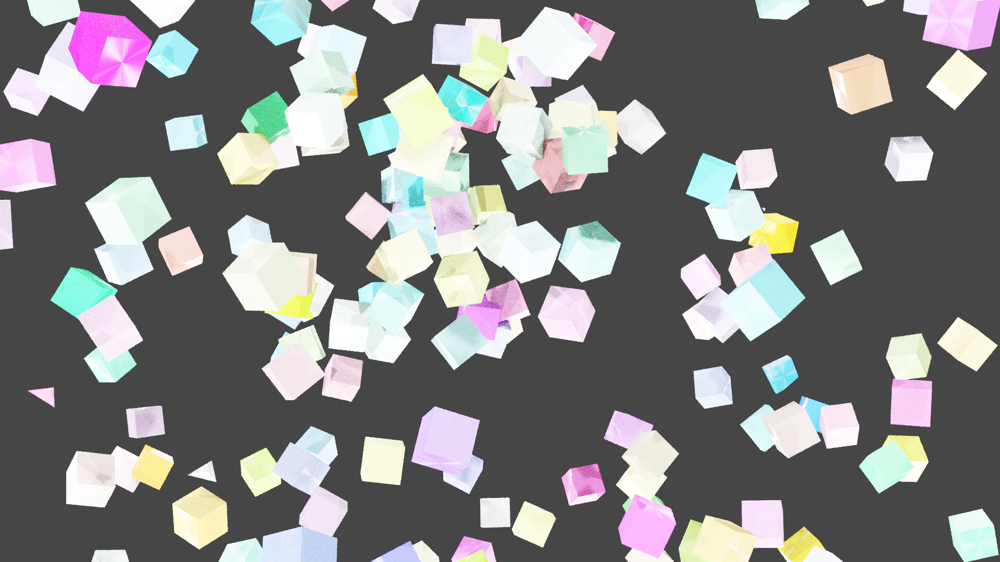

# Hello! \:wave: こんにちは

# \:cake: Happy Birthday \:smile:

<!--imats-birthday-->

<ul><li><h2><a href=https://www.google.com/search?q=古澤頼子&tbm=isch&oq=古澤頼子&sclient=img>古澤頼子</a></h2></li></ul><!--2025-05-18 03:19:32-->

<!--imats-birthday-->

# \:rainbow: 今の画像

ランダムに立方体を配置しているだけです。

# \:chart_with_downwards_trend: Lapras Activity

<!--START_SECTION:lapras-card-->

  
Last Updated on 5/17/2025, 1:47:37 AM

<!--END_SECTION:lapras-card-->

# \:chart_with_downwards_trend: Activity

 
 

# \:green_book: Blog

<!-- BLOG-POST-LIST:START -->
- [YAPC::Kyotoに参加しました](https://zenn.dev/u_tan/articles/c05fd67a6d8ea3)
- [2022を振り返る](https://zenn.dev/u_tan/articles/a7ecd9767cc251)
- [TypeScript でGoogle Apps Script&lpar;GAS&rpar;を書く](https://zenn.dev/u_tan/articles/c813e6f8255296)
- [PythonでCLIツールを作ってみた](https://zenn.dev/u_tan/articles/dca8c4539b4e13)
- [5dayガチャ開発インターンに参加しました](https://zenn.dev/u_tan/articles/8c04a33586f7e6)
- [DockerでPerlの環境を作成する](https://zenn.dev/u_tan/articles/a270b1321a6ea2)
- [ブラウザ上でコードを書いて実行&lpar;2&rpar;](https://zenn.dev/u_tan/articles/775af6ee0e9e77)
- [就活振り返り](https://zenn.dev/u_tan/articles/bd72f3719329ab)
<!-- BLOG-POST-LIST:END -->

# \:open_file_folder: 制作物

## WEB

<!--works-Web-->

<table><tr><th></th><th></th></tr><tr><td>Play Langs</td><td>Anime Library</td></tr></table>

<b>もっと見る...</b>
<table><tr><th></th><th></th></tr><tr><td>サーバルBOT</td><td>YouTubeもどき</td></tr><tr><th></th><th></th></tr><tr><td>顔認識トリミングアプリ</td><td>niconico動画もどき</td></tr><tr><th></th><th></th></tr><tr><td>自作ブログサイト(PHP)</td><td>アニメで振り返ろう</td></tr><tr><th></th><th></th></tr><tr><td>本ポートフォリオサイト</td><td>数字判定アプリ</td></tr><tr><th></th><th></th></tr><tr><td>旧ポートフォリオサイト</td><td>神経衰弱</td></tr><tr><th></th><th></th></tr><tr><td>なぞなぞゲーム</td><td>React ポートフォリオサイト</td></tr><tr><th></th><th></th></tr><tr><td>千歳市 今週のおすすめ飲食店</td><td>Cute Dog Images</td></tr><tr><th></th><th></th></tr><tr><td>ひとこと掲示板</td><td>ラブライブライブラリ</td></tr></table>

<!--works-Web-->

## Blender

<!--works-Blender-->

<table><tr><th></th><th></th></tr><tr><td>blender-rendering</td><td>回る鉛筆</td></tr></table>

<b>もっと見る...</b>
<table><tr><th></th><th></th></tr><tr><td>アイドル</td><td>おばけ</td></tr><tr><th></th><th></th></tr><tr><td>積み木の汽車</td><td>洞窟探索</td></tr><tr><th></th><th></th></tr><tr><td>コーヒーカップ</td><td>宇宙</td></tr><tr><th></th><th></th></tr><tr><td>カーテンと風</td><td>ドーナツ</td></tr><tr><th></th><th></th></tr><tr><td>ネコ型ロボット</td><td>ちびロボ</td></tr></table>

<!--works-Blender-->

<!--works-GetDtataTime-->

最終更新 : 2025-05-18 00:22:24

<!--works-GetDtataTime-->
